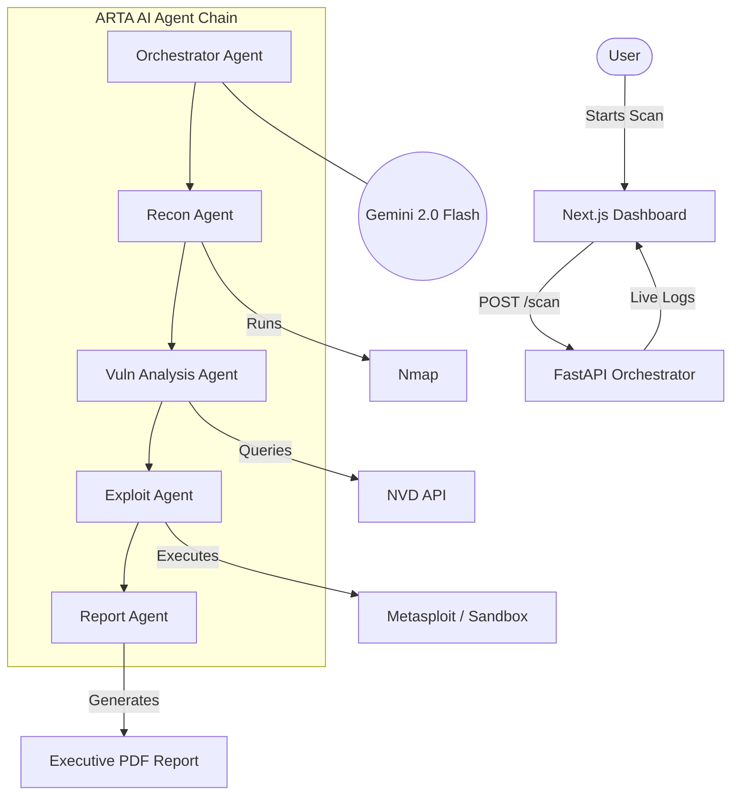

# ARTA — Autonomous Red Team Agent

> **Autonomous penetration testing pipeline powered by Gemini 2.0 Flash.**
> Recon → Vulnerability Analysis → Exploit → Professional PDF Reporting.

---

## 🚀 Overview

ARTA is a cutting-edge, autonomous security orchestration platform developed for the **Bot to Agent Hackathon**. It automates the entire penetration testing kill-chain, moving beyond simple script execution to intelligent, adaptive security auditing by leveraging the reasoning capabilities of **Gemini 2.0 Flash**.

### ⚡ Key Features

- **🎯 Autonomous Mission Planning**: Gemini orchestrates the scan based on target scope and depth.
- **🔍 Intelligent Reconnaissance**: Automated Nmap scanning with AI-powered XML parsing and service identification.
- **🛡️ Live Vulnerability Mapping**: Real-time NVD API integration combined with Gemini-ranked severity scoring.
- **💥 Self-Healing Exploitation**: Automatic Metasploit module selection and PoC generation with a 3-retry self-healing loop.
- **📄 Executive Reporting**: Professional PDF reports synthesized by AI, ready for stakeholders.
- **💻 Real-time Dashboard**: Live SSE (Server-Sent Events) log stream with a terminal-noir aesthetic.

---

## 🏗️ Architecture



---

## 📂 Project Structure

```text
arta/
├── backend/       # Python (FastAPI) — The Brain (4 AI agents)
└── frontend/      # TypeScript (Next.js 14) — The Dashboard
```

---

## 🛠️ Tech Stack

- **AI Model**: Google Gemini 2.0 Flash (`gemini-flash-lite-latest`)
- **Backend**: FastAPI, aiosqlite, httpx, pandas
- **Frontend**: Next.js 14 (App Router), TypeScript, CSS Modules, Puppeteer
- **Security Tools**: Nmap, Metasploit Framework

---

## 🚦 Quick Start

### 1. Prerequisites
- Python 3.10+
- Node.js 18+
- [Nmap](https://nmap.org/) installed and in PATH
- [Metasploit Framework](https://www.metasploit.com/) installed
- [uv](https://github.com/astral-sh/uv) (recommended for fast Python setup)

### 2. Backend Setup
```bash
cd backend
cp .env.example .env
# Edit .env: set GEMINI_API_KEY and METASPLOITABLE_IP

# Setup data (ExploitDB index)
python setup_data.py

# Install dependencies and run
uv venv
# On Windows: .venv\Scripts\activate | On Linux/Mac: source .venv/bin/activate
uv pip install -r requirements.txt
uvicorn main:app --host 0.0.0.0 --port 8000 --reload
```

### 3. Frontend Setup
```bash
cd frontend
cp .env.local.example .env.local
# Set NEXT_PUBLIC_API_URL=http://localhost:8000

npm install
npm run dev
```
Visit `http://localhost:3000` to start your mission.

---

## ⚙️ Configuration (`.env`)

| Variable | Required | Description |
|----------|----------|-------------|
| `GEMINI_API_KEY` | ✅ | Your Google AI Studio API Key |
| `METASPLOITABLE_IP` | ✅ | Target Lab VM IP (e.g., 192.168.56.101) |
| `NVD_API_KEY` | ❌ | Optional: Increases NVD rate limits |
| `DEMO_MODE` | ❌ | `true` uses pre-recorded Metasploit fixtures (useful if MSF is unstable) |

---

## ⚠️ Disclaimer

ARTA is designed for **educational and authorized security testing purposes only**. Never use this tool against targets you do not have explicit, written permission to test. The creators assume no liability for misuse or damage caused by this tool.

---

